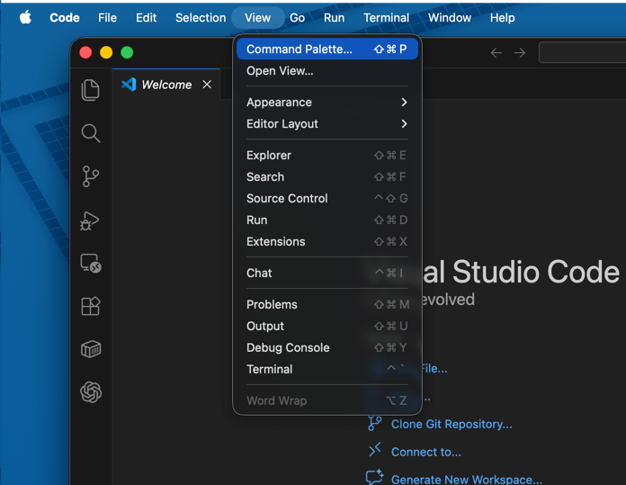
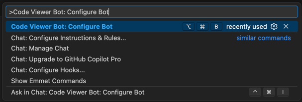
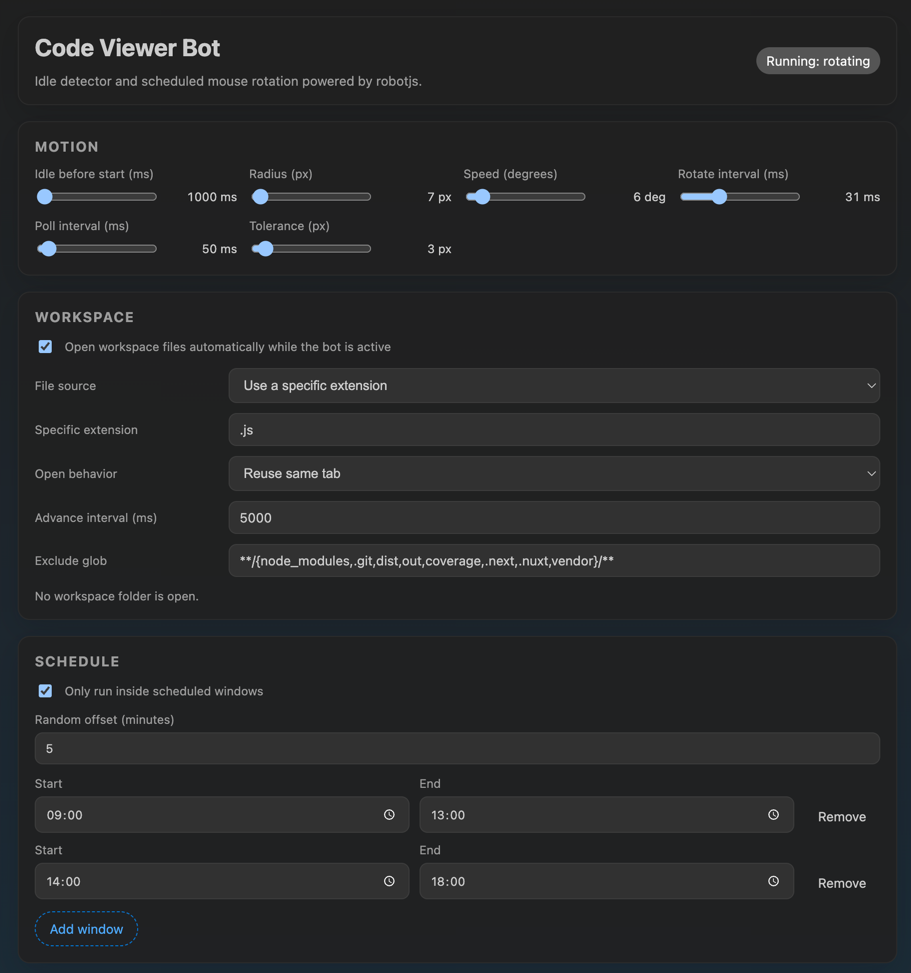

# Code Viewer Bot

Code Viewer Bot is a Visual Studio Code extension that starts automatically when VS Code finishes launching, waits for idle time, and then can move the cursor and browse workspace files during allowed schedule windows.

## Screenshots

### Configuration Command


### Command Palette


### Configuration Panel


## Features

- Starts automatically on VS Code startup.
- Uses `robotjs` for native mouse movement.
- Supports configurable idle timing, movement radius, speed, polling intervals, and workspace file browsing.
- Supports randomized daily schedule windows.
- Includes a built-in configuration panel through `Code Viewer Bot: Configure Bot`.

## Installation

Install the latest release from the [GitHub Releases page](https://github.com/kalpak44/code-viewer-bot/releases).

To build and install locally without waiting for CI:

```sh
npm install
npm run build
npx @vscode/vsce package --target darwin-arm64
```

Then install the generated `.vsix` file:

```sh
code --install-extension code-viewer-bot-darwin-arm64-0.0.1.vsix
```

You can also install it from VS Code through `Extensions` -> `...` -> `Install from VSIX...`.

For platform-specific builds, use the appropriate `vsce --target` value such as `linux-x64`, `darwin-x64`, `darwin-arm64`, or `win32-x64`.

## Usage

1. Install the extension.
2. Launch or reload VS Code.
3. Open the config panel with:
   - Command Palette: `Code Viewer Bot: Configure Bot`
   - Shortcut on Windows/Linux: `Ctrl+Alt+B`
   - Shortcut on macOS: `Cmd+Alt+B`
4. Leave the mouse idle and let the configured schedule control mouse movement and workspace browsing.

## Development

- Fastest local test flow:
  1. Open the repository in VS Code.
  2. Press `F5`.
  3. Test the extension in the Extension Development Host window.
- Local packaged test flow:
  1. Run `npm install`.
  2. Run `npm run build`.
  3. Run `npx @vscode/vsce package --target <platform>`.
  4. Install the generated `.vsix`.
- Release pipeline:
  - GitHub Actions runs when a tag matching `v*.*.*` is pushed.
  - The workflow creates or reuses the matching GitHub release.
  - Platform-specific VSIX files are built for Linux, macOS, and Windows and uploaded to that release.
- Runtime entrypoint: [src/extension.js](/Users/pau/3rd_party/sandbox/code-viewer-bot/src/extension.js)
- Config persistence: [src/config/config-store.js](/Users/pau/3rd_party/sandbox/code-viewer-bot/src/config/config-store.js)
- Runtime bot logic: [src/services/mouse-bot.js](/Users/pau/3rd_party/sandbox/code-viewer-bot/src/services/mouse-bot.js)
- Schedule generation: [src/services/schedule-service.js](/Users/pau/3rd_party/sandbox/code-viewer-bot/src/services/schedule-service.js)
- Webview UI: [src/ui/config-panel.js](/Users/pau/3rd_party/sandbox/code-viewer-bot/src/ui/config-panel.js)

## License

[MIT](LICENSE.md)
