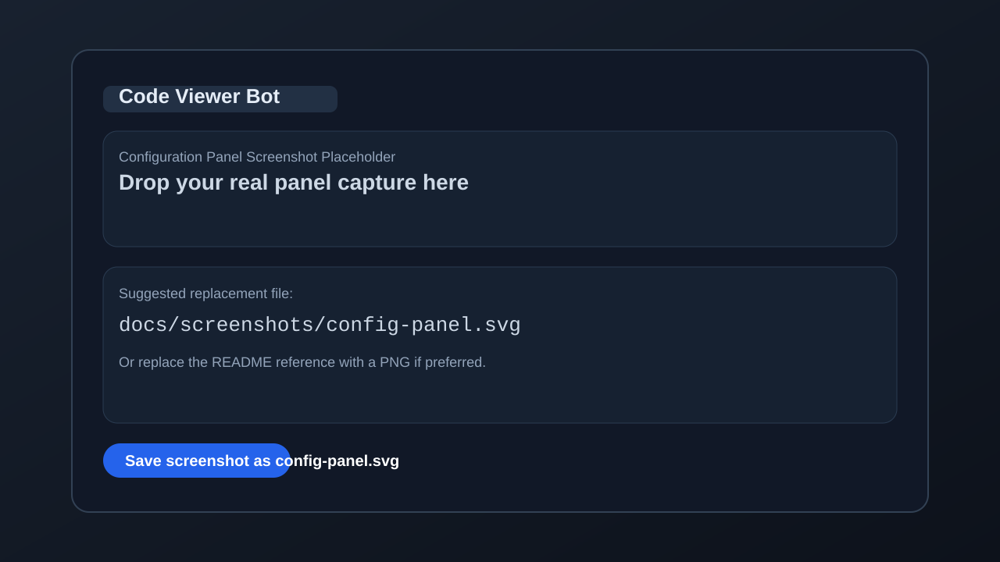
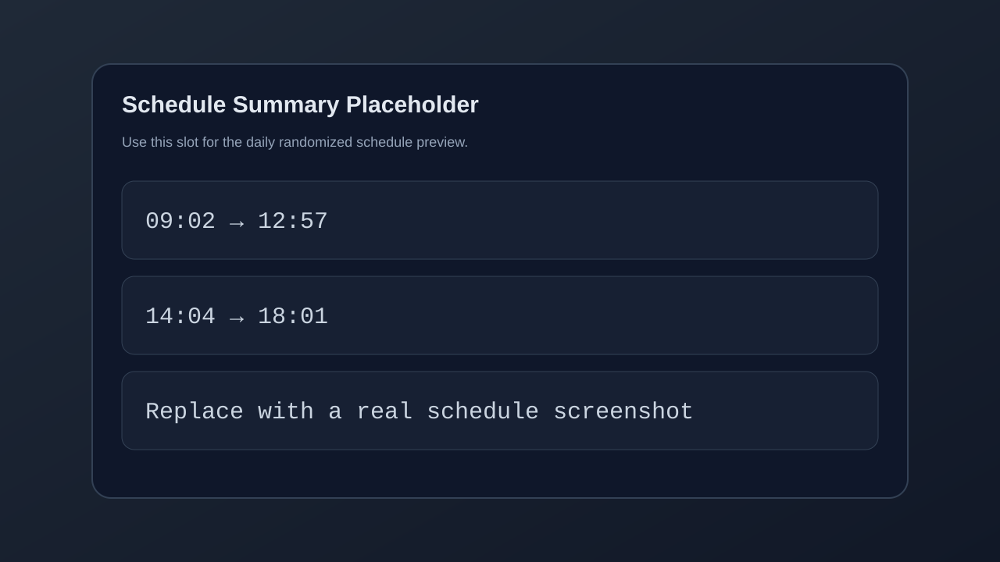

# Code Viewer Bot

Code Viewer Bot is a Visual Studio Code extension that starts automatically when VS Code finishes launching, waits for mouse idle time, and then moves the cursor in a configurable circular pattern during allowed schedule windows.

## Screenshots

### Configuration Panel


Replace this placeholder with: `docs/screenshots/config-panel.svg`

### Schedule Summary


Replace this placeholder with: `docs/screenshots/schedule-summary.svg`

## Features

- Starts automatically on VS Code startup.
- Uses `robotjs` for native mouse movement.
- Supports configurable idle timing, movement radius, speed, and polling intervals.
- Supports randomized daily schedule windows.
- Includes a built-in configuration panel through the `Open Bot Configuration` command.

## Installation

Install the latest release from the [GitHub Releases page](https://github.com/kalpak44/code-viewer-bot/releases).

To build from source:

```sh
npm install
npx @vscode/vsce package --target darwin-arm64
```

For platform-specific builds, use the appropriate `vsce --target` value such as `darwin-x64`, `darwin-arm64`, or `win32-x64`.

## Usage

1. Install the extension.
2. Launch or reload VS Code.
3. Open the command palette and run `Open Bot Configuration` to adjust the settings.
4. Leave the mouse idle and let the configured schedule control when rotation is allowed.

## Development

- Runtime entrypoint: [src/extension.js](/Users/pau/3rd_party/sandbox/code-viewer-bot/src/extension.js)
- Config persistence: [src/config/config-store.js](/Users/pau/3rd_party/sandbox/code-viewer-bot/src/config/config-store.js)
- Runtime bot logic: [src/services/mouse-bot.js](/Users/pau/3rd_party/sandbox/code-viewer-bot/src/services/mouse-bot.js)
- Schedule generation: [src/services/schedule-service.js](/Users/pau/3rd_party/sandbox/code-viewer-bot/src/services/schedule-service.js)
- Webview UI: [src/ui/config-panel.js](/Users/pau/3rd_party/sandbox/code-viewer-bot/src/ui/config-panel.js)

## License

[MIT](LICENSE.md)
