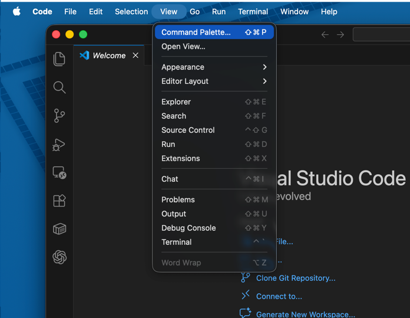
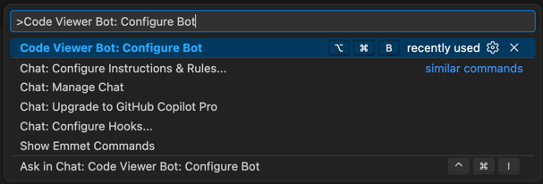
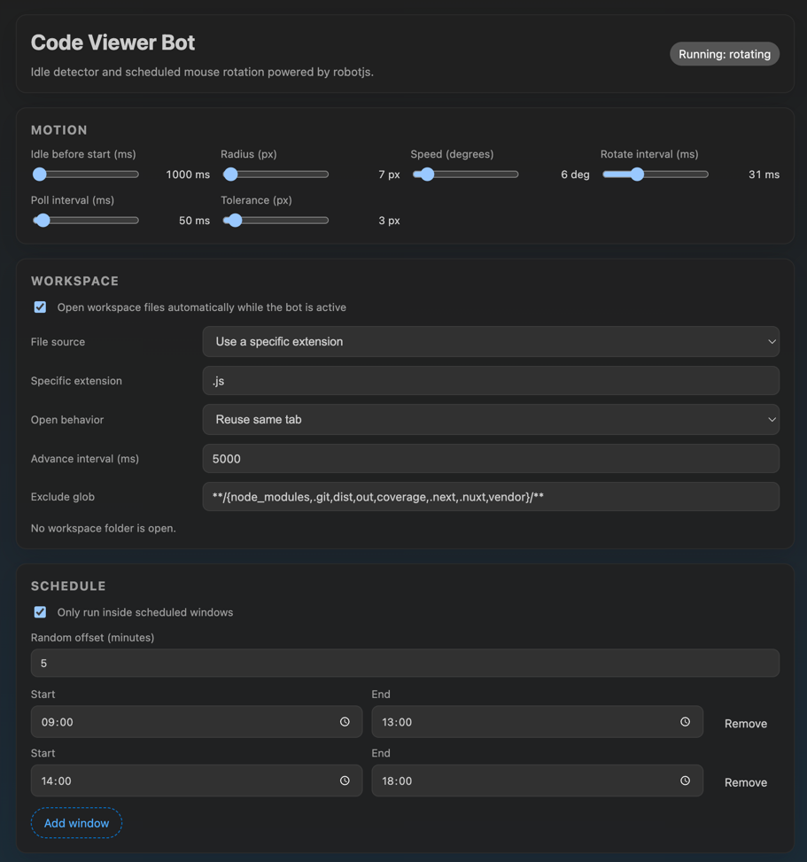

# Code Viewer Bot

[](https://marketplace.visualstudio.com/items?itemName=kalpakus.code-viewer-bot)
[](https://marketplace.visualstudio.com/items?itemName=kalpakus.code-viewer-bot)
[](https://marketplace.visualstudio.com/items?itemName=kalpakus.code-viewer-bot&ssr=false#review-details)
[](https://github.com/kalpak44/code-viewer-bot/releases/latest)
[](./LICENSE.md)

Code Viewer Bot keeps your VS Code window looking active while you're away from the
keyboard. After you've been idle for a bit, it can move the cursor in a small loop and
browse through files in your workspace — useful for screen-lock timeouts, status
indicators that care about "away" state, or simply keeping a demo screen alive.

It runs entirely on your machine. Nothing is sent over the network, and the bot stays
off outside the schedule windows you configure.

## Features

- **Idle-triggered mouse movement** — a small circular motion that resets once real user
  input is detected
- **Automatic file browsing** — opens workspace files on a timer, by the workspace's most
  common text-file extension or one you choose
- **Schedule windows** — confine the bot to specific times of day, with optional random
  jitter so the pattern doesn't look mechanical
- **Multi-window aware** — when several VS Code windows are open, only one runs the bot
  at a time; the rest stay in standby
- **Zero network access** — everything runs locally; the bot reads only your workspace
  file list and local cursor/idle state

## Install

**From the Marketplace** (recommended): search for **Code Viewer Bot** in the VS Code
Extensions view, or install directly:

```sh
code --install-extension kalpakus.code-viewer-bot
```

Or open the [Marketplace listing](https://marketplace.visualstudio.com/items?itemName=kalpakus.code-viewer-bot) and click **Install**.

**From a GitHub Release**: every release attaches a platform-specific `.vsix` to
[GitHub Releases](https://github.com/kalpak44/code-viewer-bot/releases). Download the one
matching your platform (see [Supported Platforms](#supported-platforms)), then in VS Code:
`Extensions` → `...` menu → `Install from VSIX...`.

## Permissions

The bot uses [`robotjs`](https://github.com/octalmage/robotjs) for native mouse control,
which needs OS-level input permissions:

- **macOS**: VS Code (or your terminal, if run from `code .`) needs **Accessibility**
  permission under `System Settings → Privacy & Security → Accessibility`. Without it,
  the configuration panel reports that `robotjs` is unavailable instead of silently
  failing.
- **Windows**: no extra permission is needed; cursor control works out of the box.
- **Linux**: requires an active X11 session. Wayland is not supported by `robotjs`.

No permission beyond cursor/keyboard control is requested, and the extension never reads
file contents beyond deciding whether a file looks like text for the purpose of opening
it in the editor.

## Configure

Open the configuration panel from the Command Palette (`Code Viewer Bot: Configure Bot`),
or `⌘⌥B` on macOS / `Ctrl+Alt+B` on Windows and Linux.





The panel also shows two runtime identity fields: `This window` (the current window) and
`Active window` (the window currently running the bot).

### Motion

- `Move the mouse automatically while the bot is active`: toggles cursor movement
  independently of file rotation
- `Idle before motion (sec)`: idle time required before cursor movement starts
- `Radius (px)` / `Speed (degrees)` / `Rotate interval (ms)`: shape of the circular motion
- `Poll interval (ms)`: how often idle and schedule state is re-checked
- `Tolerance (px)`: cursor drift allowed before it's treated as real user input

### Workspace

- `Open workspace files automatically while the bot is active`: toggles file rotation
- `File source`: the workspace's most common text-file extension, or one you pick
- `Open behavior`: reuse the current tab, or keep opening new tabs
- `Idle before file browsing`: separate idle threshold from motion
- `Delay between file opens` / `Exclude glob`: pacing and paths to skip while scanning

### Schedule

- `Only run inside scheduled windows`: confines the bot to one or more daily time ranges
- `Random offset (minutes)`: per-day jitter added to each window's start and end

Outside an enabled schedule, the bot does nothing.

### Instance Control

- `Allow only one VS Code window to run the bot`: keeps one window active, others standby

## Supported Platforms

Every release ships a native build for each of these, verified in CI by actually loading
the native binding from the packaged `.vsix` before it's published:

| Platform            | VSIX asset                          |
| ------------------- | ----------------------------------- |
| Linux x64           | `code-viewer-bot-linux-x64.vsix`    |
| Linux ARM64         | `code-viewer-bot-linux-arm64.vsix`  |
| macOS Apple Silicon | `code-viewer-bot-darwin-arm64.vsix` |
| macOS Intel         | `code-viewer-bot-darwin-x64.vsix`   |
| Windows x64         | `code-viewer-bot-win32-x64.vsix`    |
| Windows ARM64       | `code-viewer-bot-win32-arm64.vsix`  |

## Troubleshooting

- **"robotjs is not available" warning**: on macOS, check Accessibility permission (see
  [Permissions](#permissions)); on Linux, confirm an X11 session is active.
- **Nothing happens**: check the configuration panel status first — the bot may be
  outside its scheduled window, or still waiting for the configured idle interval.
- **Workspace browsing skips a file**: only text-like files are opened; files that look
  binary are skipped on purpose.

## Security

Vulnerability reports and the supported-version policy are documented in
[`SECURITY.md`](./SECURITY.md). Please do not open a public issue for a suspected
vulnerability.

## Contributing / Development

### Prerequisites

- Node.js and npm
- VS Code
- native build prerequisites required by `robotjs` (only needed if a local install can't
  use a prebuilt binary for your platform)

### Build and run locally

```sh
npm install
npm run build
```

For live development, open this repository in VS Code and press `F5` to launch an
Extension Development Host.

### Package a local VSIX

```sh
npx @vscode/vsce package --target darwin-arm64
```

Valid `--target` values: `linux-x64`, `linux-arm64`, `darwin-x64`, `darwin-arm64`,
`win32-x64`, `win32-arm64`.

```sh
code --install-extension code-viewer-bot-darwin-arm64-0.1.0.vsix --force
code --uninstall-extension kalpakus.code-viewer-bot
```

### Release pipeline

Releasing is driven by a single workflow,
[`.github/workflows/release.yml`](./.github/workflows/release.yml), triggered by a `v*`
tag:

1. Bump `version` in [`package.json`](./package.json) (and add a [`CHANGELOG.md`](./CHANGELOG.md) entry), commit, tag `v<version>`, and push with the tag.
2. The workflow verifies (format, lint, tests, Sonar gate), then builds all six platform
   VSIX files in parallel, loading `robotjs` from each packaged `.vsix` before it's
   accepted.
3. It creates the GitHub Release for that tag with generated notes and all six assets,
   then publishes each VSIX to the Marketplace automatically.

A push to `main` that doesn't carry a new tag only re-verifies; it never builds or
publishes. Dependency updates are proposed daily by Dependabot
([`.github/dependabot.yml`](./.github/dependabot.yml)) and reviewed, repaired and merged
by an automated maintenance agent, which also cuts the release tag once a sweep's merges
are done.

### Runtime structure

- runtime entrypoint: [`src/extension.js`](./src/extension.js)
- config normalization and persistence: [`src/config/config-store.js`](./src/config/config-store.js)
- core runtime behavior: [`src/services/mouse-bot.js`](./src/services/mouse-bot.js)
- workspace file rotation: [`src/services/workspace-navigator.js`](./src/services/workspace-navigator.js)
- schedule generation: [`src/services/schedule-service.js`](./src/services/schedule-service.js)
- webview UI: [`src/ui/config-panel.js`](./src/ui/config-panel.js)

## License

[MIT](LICENSE.md)
